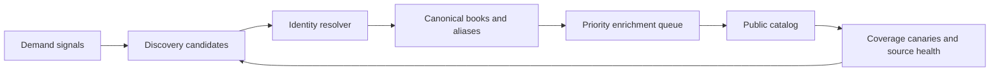

# Hotlist Catalog Durability Strategy

Date: 2026-05-30

## Objective

Make Hotlist reliably answer the reader's first question: "Do you know this book?"

The catalog should optimize for demand-weighted coverage, not raw row count. A smaller, current catalog of books readers search for is more valuable than a large catalog with stale ratings, unresolved provisional rows, and missing trending titles.

## Current Risks

The production audit in `2026-05-30-walmart-fantasy-romance-top20.md` found:

- 7/20 public matches
- 2/20 exact-title provisional rows stuck outside public surfaces
- 11/20 missing credible matches
- stale ratings on surfaced books: 52-67 days old
- incomplete Amazon ASIN and Romance.io slug persistence

The implementation review found:

- `app/api/cron/amazon-bestsellers/route.ts` exists, but is not scheduled in `vercel.json`.
- `app/api/cron/monthly-enrichment/route.ts` runs once monthly, selects at most 50 books, and updated only 8 books in each of its April and May runs.
- Production has 8,497 books, including 919 pending non-canon rows and 487 partial canon rows.
- Search supplements from external sources only when cached results number fewer than 3. Three weak local suggestions can prevent discovery of the requested title.
- Search suggestions do not apply a strong relevance floor, so missing-title searches can display plausible but unrelated results.
- 1,006 legacy `trope_inference` jobs remain pending even though that job type is not in the worker priority tiers.

## Target Architecture

### 1. Demand Signals

Continuously collect candidates from:

- NYT discovery
- Amazon bestseller discovery via Serper
- Walmart fantasy-romance bestseller page or harvester uploads
- BookTok grabs
- user searches with no high-confidence match
- Goodreads imports
- creator recommendations

Each candidate should retain `source`, `source_rank`, `first_seen_at`, `last_seen_at`, and `demand_score`.

### 2. Identity Resolver

Resolve candidates in this order:

1. Goodreads ID
2. ISBN-13 / ISBN
3. Amazon ASIN
4. Google Books ID
5. normalized title + author
6. reviewed fuzzy match

Add a `book_aliases` table for retailer subtitles and alternate titles. Example:

- canonical: `King of Flesh and Bone: A Dark Fantasy Romance`
- alias: `King of Flesh and Bone`

Fuzzy matches must never silently replace identity resolution.

### 3. Priority Enrichment

Split enrichment into service levels:

| Tier | Books | Freshness target | Required jobs |
| --- | --- | --- | --- |
| P0 | current bestseller canaries, active search misses, BookTok grabs | identity within 15 min; ratings within 1 hour | Goodreads identity/detail, ratings, ASIN, Romance.io spice |
| P1 | books searched or viewed recently, creator books, imported books | ratings within 7 days | ratings, ASIN, spice, metadata |
| P2 | remaining canon catalog | ratings within 30 days | ratings and missing core metadata |
| P3 | low-demand long tail | best effort | deferred nice-to-have enrichment |

Core jobs must run before Spotify, Reddit buzz, and discussion links. Track freshness per source using `book_ratings.scraped_at`, not only `books.last_enriched_at`.

### 4. Search Behavior

Change the discovery trigger from:

> supplement externally if fewer than 3 cached results exist

to:

> supplement externally if no high-confidence title or author match exists

Apply a minimum suggestion relevance floor. When Hotlist does not have the requested title, say so clearly and start a fast-track discovery job. Do not fill the UI with loosely related suggestions unless they are explicitly labeled as alternatives.

### 5. Coverage Canaries

Run a daily catalog canary against a fixed external sample:

- top 100 romantasy / fantasy-romance books from retail and editorial inputs
- top 100 romance books overall
- top 100 recent user search misses

Measure:

- public match coverage
- provisional backlog age
- Goodreads, Amazon, and Romance.io coverage
- per-source rating freshness
- alias/title-normalization misses
- wrong-suggestion rate

Store snapshots in `quality_health_log` and alert on regressions.

## Delivery Plan

### Phase 1: Stabilize This Week

1. Schedule `amazon-bestsellers` daily.
2. Seed and fast-track the 13 unresolved or non-public titles from the audit.
3. Replace the monthly inline 50-book refresh with queued daily refresh jobs ordered by demand and source staleness.
4. Add a search relevance floor and trigger external discovery when there is no strong match.
5. Clear or migrate the 1,006 orphaned `trope_inference` jobs.

### Phase 2: Make It Durable

1. Add `discovery_candidates`, `book_aliases`, and demand-priority fields.
2. Add P0/P1/P2 queue priority and source-specific freshness SLAs.
3. Persist Amazon ASIN and Romance.io slug when values are scraped.
4. Add daily external canary ingestion and coverage reporting.
5. Add an admin view for unresolved candidates and stale high-demand books.

### Phase 3: Improve the Moat

1. Use search misses, BookTok grabs, follows, and saves to update demand scores.
2. Add community spice collection prompts on high-demand books with weak spice signals.
3. Use creator recommendations and hotlists to discover emerging titles before retailer lists catch up.

## Initial SLOs

- 95% public match coverage for the top 200 demand-ranked books
- 95% of P0 books have Goodreads identity within 15 minutes
- 90% of P0/P1 ratings refreshed within 7 days
- 90% of P0/P1 books have a spice score
- fewer than 2% wrong-suggestion rate for exact-title canary searches
- provisional P0 backlog older than 24 hours: zero
